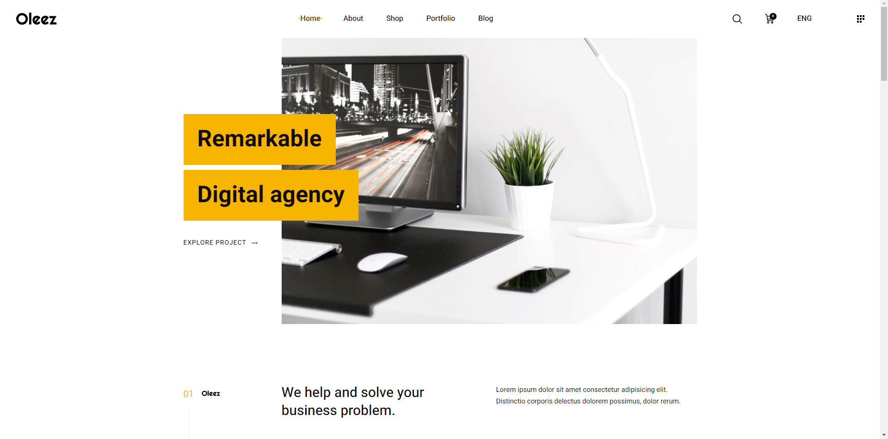
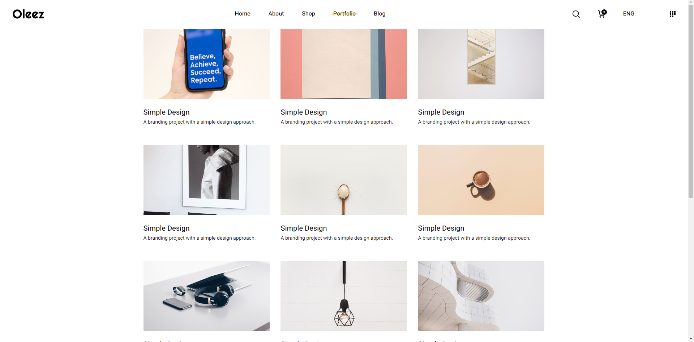
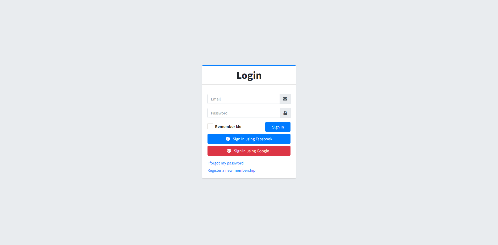
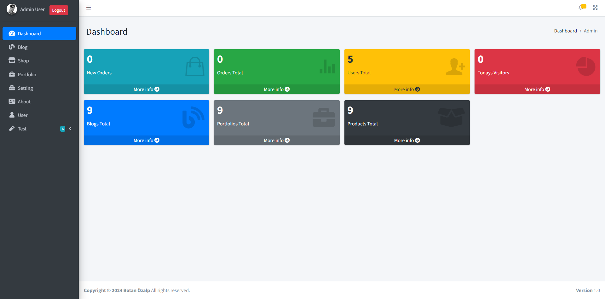
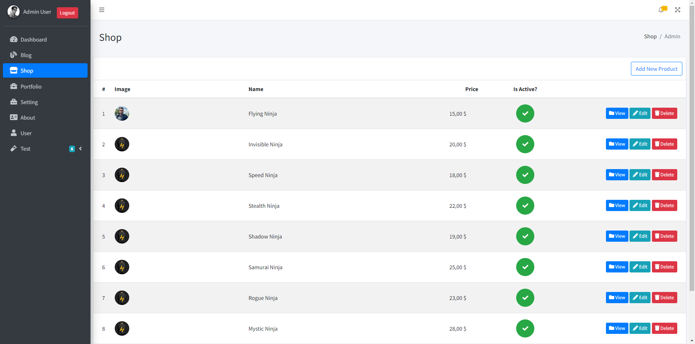
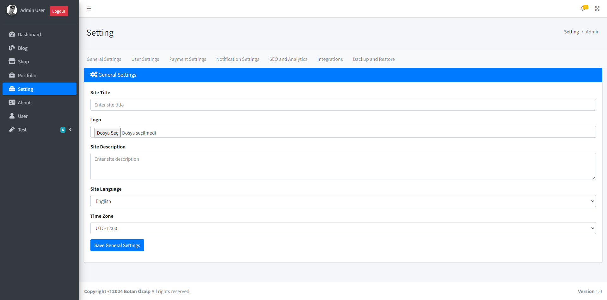

# ASP.NET Core Blog and E-Commerce Platform

This project is a sample blog and e-commerce application developed using ASP.NET Core and Entity Framework Core. It includes features for user management, blogs, portfolios, carts, orders, and more. This project is under active development.

## Technologies Used

- ASP.NET Core: For building the web application.
- Entity Framework Core: For interacting with the database using ORM.
- Identity Framework: For handling authentication and authorization.
- SQL Server: As the relational database management system.
- Dependency Injection: For managing dependencies and promoting loose coupling.
- Repository Pattern: For abstracting data access logic.
- Unit of Work Pattern: For managing transactions.

## Getting Started

### Prerequisites

- .NET 6 SDK or later
- SQL Server

### Installation

1. Clone the repository:

   ```bash
   git clone https://github.com/yourusername/aspnet-core-blog-ecommerce-platform.git
   cd aspnet-core-blog-ecommerce-platform
   ```

2. Update the `appsettings.json` file with your SQL Server connection string.

3. Apply the migrations and update the database:

   ```bash
   dotnet ef database update
   ```

4. Run the project:

   ```bash
   dotnet run
   ```

### Features

- **User Authentication and Authorization**: Secure login and role-based access control.
- **Blog Management**: Create, read, update, and delete blog posts.
- **Portfolio Management**: Showcase projects and portfolios.
- **Shopping Cart**: Add products to the cart and manage them.
- **Order Management**: Place orders and track them.
- **Admin Dashboard**: Manage users, settings, and other administrative tasks.

### Screenshots

#### Main Page


#### Portfolios Page


#### Login Page


#### Admin Main Page


#### Admin Products


#### Admin Settings Page


### Project Structure

- `DataLayer`: Contains the database context, entity models, and repository implementations.
- `ServiceLayer`: Contains business logic and service implementations.
- `Controllers`: Contains the MVC controllers for handling HTTP requests.
- `Views`: Contains the Razor views for rendering HTML pages.

### Contributing

This project is under active development. Contributions are welcome! Please fork the repository and create a pull request with your changes.

### License

This project is licensed under the MIT License.

---

# ASP.NET Core Blog ve E-Ticaret Platformu

Bu proje, ASP.NET Core ve Entity Framework Core kullanılarak geliştirilmiş örnek bir blog ve e-ticaret uygulamasıdır. Kullanıcı yönetimi, bloglar, portföyler, sepetler, siparişler ve daha fazlası için özellikler içerir. Bu proje aktif olarak geliştirilmektedir.

## Kullanılan Teknolojiler

- ASP.NET Core: Web uygulaması geliştirmek için.
- Entity Framework Core: ORM kullanarak veritabanı ile etkileşim için.
- Identity Framework: Kimlik doğrulama ve yetkilendirme için.
- SQL Server: İlişkisel veritabanı yönetim sistemi olarak.
- Bağımlılık Enjeksiyonu: Bağımlılıkları yönetmek ve gevşek bağlanmayı teşvik etmek için.
- Repository Deseni: Veri erişim mantığını soyutlamak için.
- Unit of Work Deseni: İşlemleri yönetmek için.

## Başlangıç

### Gereksinimler

- .NET 6 SDK veya üstü
- SQL Server

### Kurulum

1. Depoyu klonlayın:

   ```bash
   git clone https://github.com/yourusername/aspnet-core-blog-ecommerce-platform.git
   cd aspnet-core-blog-ecommerce-platform
   ```

2. `appsettings.json` dosyasını SQL Server bağlantı dizesiyle güncelleyin.

3. Migrasyonları uygulayın ve veritabanını güncelleyin:

   ```bash
   dotnet ef database update
   ```

4. Projeyi çalıştırın:

   ```bash
   dotnet run
   ```

### Özellikler

- **Kullanıcı Kimlik Doğrulama ve Yetkilendirme**: Güvenli giriş ve rol tabanlı erişim kontrolü.
- **Blog Yönetimi**: Blog yazılarını oluşturun, okuyun, güncelleyin ve silin.
- **Portföy Yönetimi**: Projeleri ve portföyleri sergileyin.
- **Alışveriş Sepeti**: Ürünleri sepete ekleyin ve yönetin.
- **Sipariş Yönetimi**: Sipariş verin ve takip edin.
- **Yönetici Paneli**: Kullanıcıları, ayarları ve diğer yönetim görevlerini yönetin.

### Ekran Görüntüleri

#### Ana Sayfa


#### Portföyler Sayfası


#### Giriş Sayfası


#### Yönetici Ana Sayfası


#### Yönetici Ürünler


#### Yönetici Ayarları Sayfası


### Proje Yapısı

- `DataLayer`: Veritabanı bağlamı, varlık modelleri ve repository uygulamalarını içerir.
- `ServiceLayer`: İş mantığı ve servis uygulamalarını içerir.
- `Controllers`: HTTP isteklerini işleyen MVC denetleyicilerini içerir.
- `Views`: HTML sayfalarını render eden Razor görünümlerini içerir.

### Katkıda Bulunma

Bu proje aktif olarak geliştirilmektedir. Katkılar memnuniyetle karşılanır! Lütfen depoyu forklayın ve değişikliklerinizle bir pull request oluşturun.

### Lisans

Bu proje MIT Lisansı ile lisanslanmıştır.
